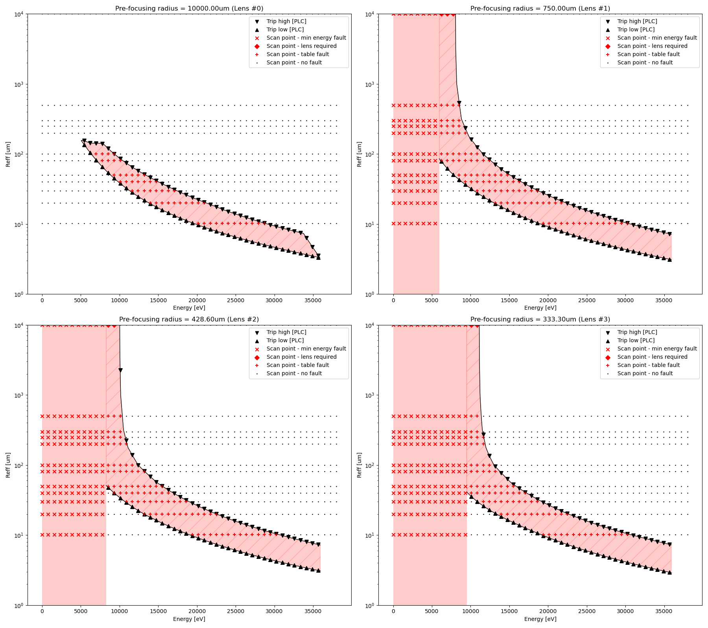
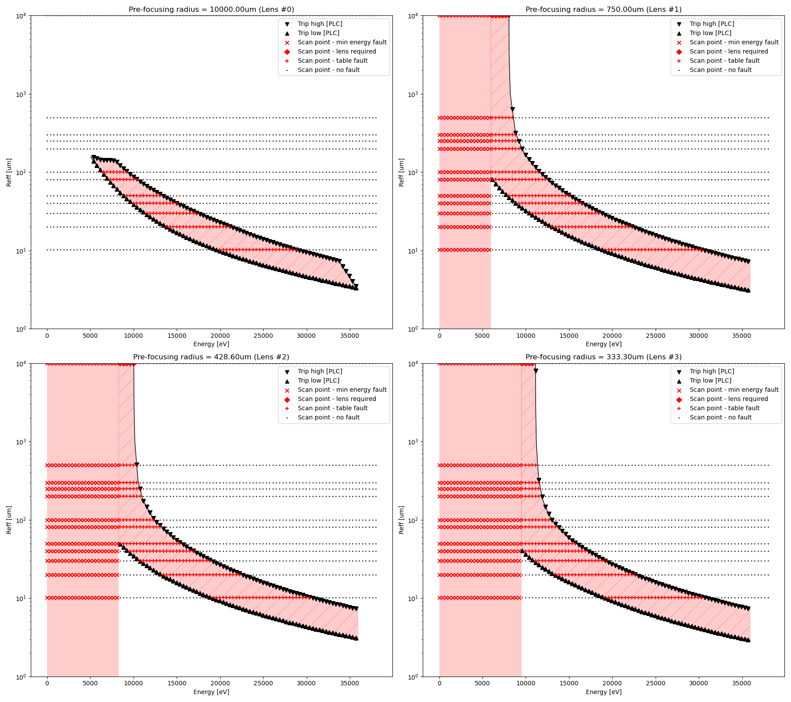

MFX Lens Interlock Automated Checkout Reports
=============================================

Notes
-----

* Data generation time is erroneously in GMT (please subtract 8 hours for accurate California time).

2021/06/09, 3:38 PM
-------------------

1. PLC code: R1.0.1 confirmed to be running
2. IOC code: R1.0.0 (in dev area)
3. PCDS environment: v4.5.1
4. Transfocate: v0.5.1

Run on ``mfx-control``.

```
$ ipython -i -m transfocate.automated_checkout

...

Run scans and generate report? ('yes' to continue)
yes
Number of data points? Default: 50

Scanning with num_points=50...
```


[Report](report_20210609_1538.pdf)

20210609_1638
=============

1. PLC code: R1.0.1 confirmed to be running
2. IOC code: R1.0.0 (in release area)
3. PCDS environment: v4.5.1
4. Transfocate: v0.5.1


Run on ``mfx-control``.

```
$ ipython -i -m transfocate.automated_checkout

...

Run scans and generate report? ('yes' to continue)
yes
Number of data points? Default: 50
100
Scanning with num_points=100...
```


[Report](report_20210609_1638.pdf)

Took approximately 8 minutes from start to finish.
